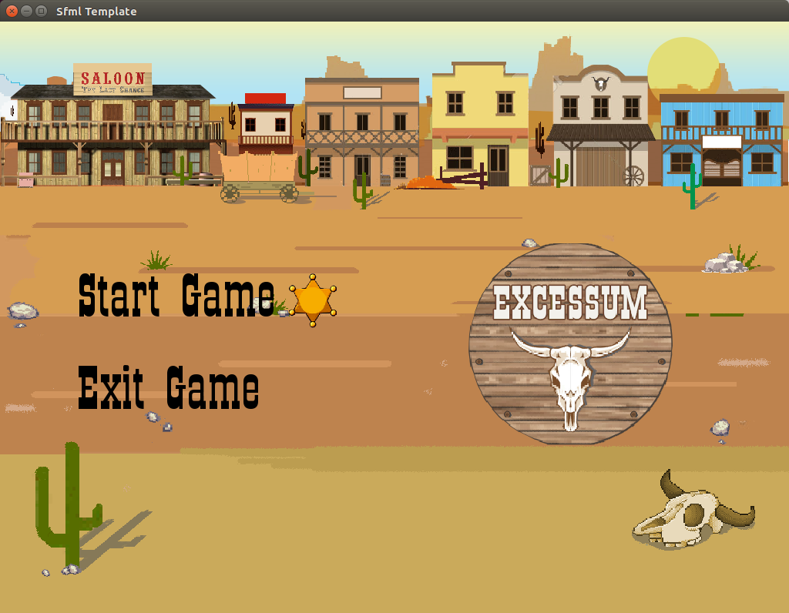
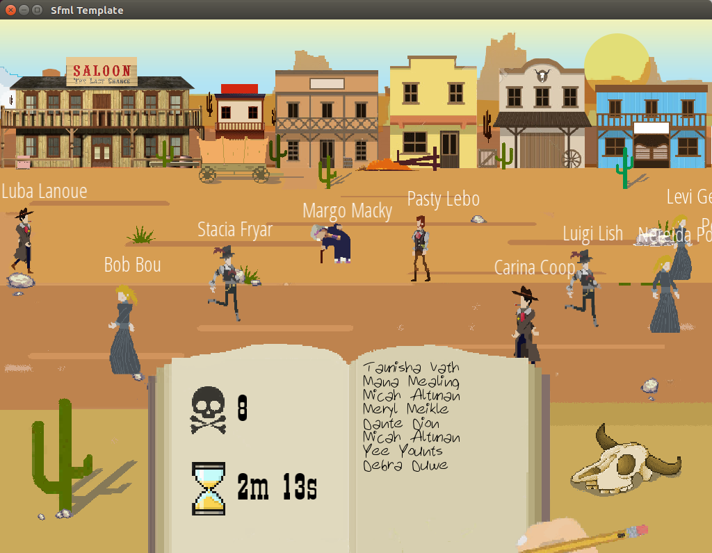

# Excessum

## :scroll: Story
It's a very warm day without water right now...

I'm traveling through western deserts, trying not to die.

Sometimes I wish to die.

Maybe death is better then we think it is, who knows.

Wait, what is that!? I saw a black book on the ground in the sand.

I need to see what it is.

It's blank, but there is a text that says "Write a name of someone with this pencil and that person will be in a better place. Help somebody."

It sounds interesting, but not realistic...

After hours of walking I have come near some rich village.

Let's try this!

## :computer: Getting Started

These instructions will get you a copy of the game up and running on your local machine. This version is mainly tested on Ubuntu.

### Prerequisites

What things you need to install the software and how to install them

1. **Install g++**

```sh
$ sudo apt-get update
$ sudo apt-get install g++
```

2. **Install SFML library**

There are three ways to install SFML library:

* Using package manager

```sh
$ sudo apt-get install libsfml-dev
```
* Download the SDK

Download the SDK from the [download page](https://www.sfml-dev.org/download.php), unpack it and copy the files to your preferred location: either a separate path in your personal folder (like /home/me/sfml), or a standard path (like /usr/local). 

* Building SFML yourself

If you want to go this way, there's a dedicated tutorial on building SFML yourself.

## :wrench: Setup and run the game

1. Download (clone) this repository
2. If there is no exec.exe output file, type 'make' in your terminal (wihtout quotes)
3. Type './exec.exe' in your terminal (again, without quotes)
4. Play the game

## :video_game: Gameplay
This game will help you to master your blind typing skill in a funny way. (hint: :bomb:) 
Go through menu with w/s or up/down keys, and select options with enter/space key. Start typing names you see on the screen. Enjoy.

<p>P.S. Yes, game IS inspired by anime 'Death Note'</p>




## :hammer: Authors

### Programmers
* **Ivan** - https://github.com/ivke080
* **Bojan** - https://github.com/BojanV03

### Artists
* **Dusan** - https://www.behance.net/dusanzubcice
* **Stefan** - https://www.facebook.com/stefan.zrnovic
* **Toni** - https://github.com/1not
